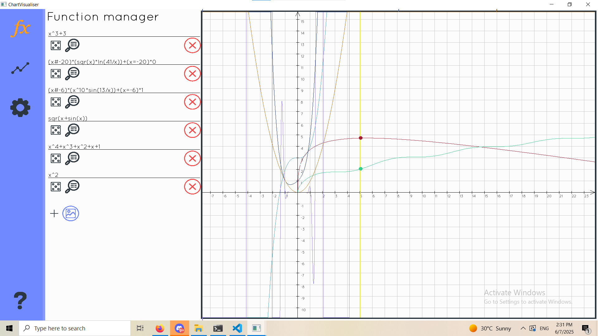

*Desktop application that let's you visualise mathematical functions.*

# Table of contents

1. [Set-up](#set-up)
2. [Features](#usage)
3. [Technologies/Concepts](#development)
 

## Set-up:

Please make sure you have `GNU Make` and `MingGW` on your computer.  
You can follow this [tutorial](https://www.youtube.com/watch?v=j5gJJe_0zP4).

**Note:** `MinGW` is also called `GCC/G++`, so the tutorial covers it all.


After you install them and add them to path, run the following:

```powershell
    # installs all dependencies and set-up the build enviroment
    make set-up
    ...
    # may take a while, as the SFML library will be compiled for your version of MinGW
    ... 
    # compiles the actual source code into a binary
    make all
    # done !
```


## Features 

- Supports 10 functions at 60FPS
- Create breakpoints on the graph
- Set function intervals
- Calculates integrals on a given interval
- Calculates local and global maxima/minima 
- Supports zooming in/zooming out


## Technologies/Concepts
- `C++ 17` with `SFML` and `tinyfiledialog` libraries
- Graph calculation uses [reverse polish notation](https://www.youtube.com/watch?v=7ha78yWRDlE) to create an array of function pointers that represent the order of calculation
- Equation rendering is CPU accelerated, using half of the threads of your current PC at maximum.
